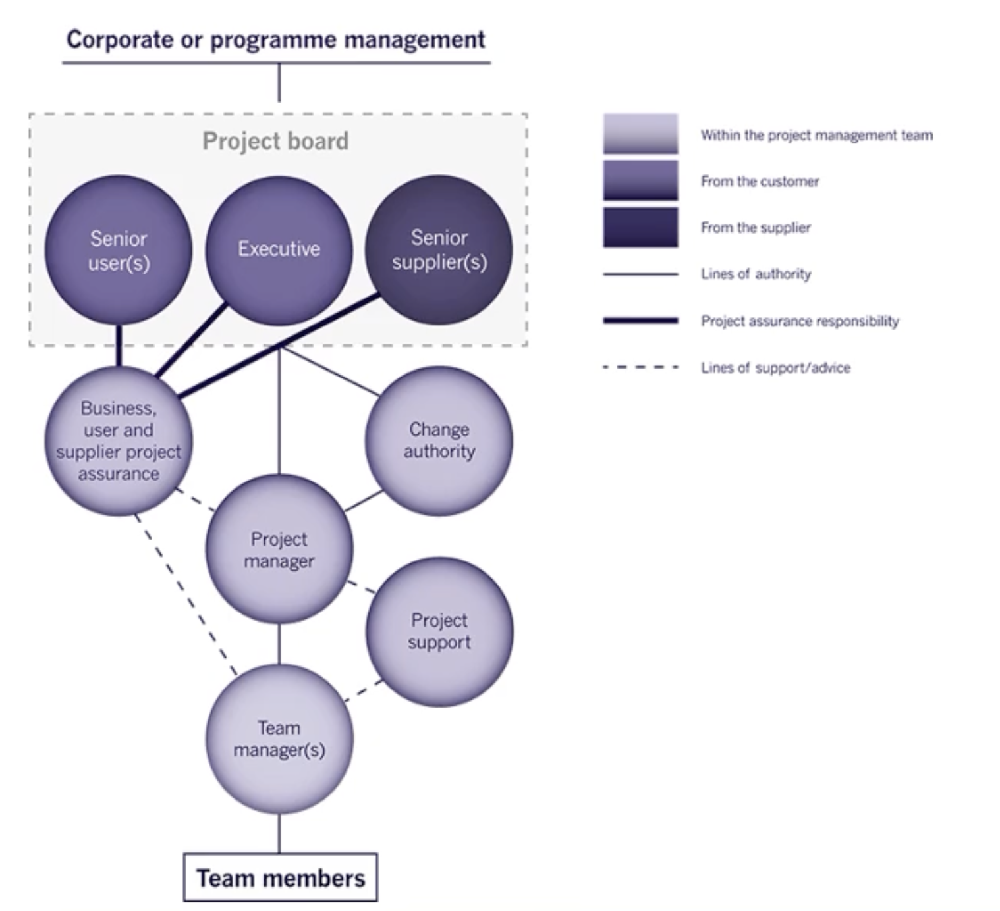

# IFB295 Study Guide | 2022 Semester 2

Mark Walpole | Notes for IAB330 at the Queensland University of Technology

<h1>Table of Contents</h1>
<ul>
	<li><a href="#IFB295">IFB295: IT Project Management</a></li>
	<ul>
		<li><a href="#week1">Week 1</a>: Project Management, User Stories, Scrum, and Teamwork</li>
		<li><a href="#week2">Week 2</a>: Why Agile? Scrum framework, Principles. and Roles</li>
		<li><a href="#week3">Week 3</a>: Project cost, Velocity, Release planning, and Sprint planning meetings</li>
		<li><a href="#week4">Week 4</a>: Agile Manifesto, DSDM Philosophy and Principles, Success Factors and Risks</li>
		<li><a href="#week5">Week 5</a>: DSDM, people, teams and interaction</li>
		<li><a href="#week6">Week 6</a>: DSDM Process, Products, Phases, and Control using MoSCoW</li>
		<li><a href="#week7">Week 7</a>: DSDM Requirements modelling, Structured timeboxes and Control with Iterative Development</li>
		<li><a href="#week8">Week 8</a>: PM Agile vs Waterfall, PRINCE2 Overview, and Risk Management</li>
		<li><a href="#week9">Week 9</a>: </li>
		<li><a href="#week10">Week 10</a>: </li>
		<li><a href="#week11">Week 11</a>: </li>
		<li><a href="#week12">Week 12</a>: </li>
		<li><a href="#week13">Week 13</a>: </li>
	</ul>
</ul>

 

<h1 id="IFB295">IFB295: IT Project Management</h1>

In your information technology career, you will participate in and then lead project teams that are expected to deliver real benefits to stakeholders. This unit builds on your previous studies of earlier units to define a high-level solution by using a range of approaches of project management methodologies and frameworks. You will enhance your learning of these approaches (Agile, PRINCE2 etc.) by practicing it collaboratively with other students. To be successful in a complex environment, you need to employ appropriate project management strategies, tools and techniques for a given context. This unit provides you with the necessary knowledge and skills to enable you to effectively manage your project in the IFB398 Capstone Project (Phase 1) and IFB399 Capstone Project (Phase 2) and to be prepared for a project environment in industry. 

 

<h2 id="week1">Week 1: Project Management, User Stories, Scrum, and Teamwork</h2>

### Project Management
Project management is the act of planning, organising and creating procedures and protocols to ensure that a project achieves it's goals, is delivered on time and is of a high quality.

### Terminology
- Methodology
  - A methodology is a set of methods, principles and rules that follow concepts such as paradigm, theoretical model, phases and techniques.
- Framework
  - A framework is a basic structure underlying a system, concept, or text
- Artifact
  - A by-product produced during the development. This could be a use case diagram, class diagram or other design documents that help describe the design and architecture

### Scrum
Scrum is a framework designed to help teams work together. Scrum encourages development teams to learn through different experiences, self-organise themselves while working on a problem, and reflect on their progress, wins, and losses in an attempt to continuously improve themselves.

### Scrum Roles and Responsibilities
- Product Owner
  - This is the owner of the product. They are responsible for optimising value, ordering the product backlog in priority and product incrementing
- Scrum Team
  - The scrum team is the team working on the project. They are responsible for self-origanisation, cross-functional, ordering and choosing which items appear in the sprint backlog
- Scrum Master
  - The scrum master is the leader of the scrum team. They are responsible for coaching, training, and supporting the scrum team.

### User Stories
User stories are short informal descriptions explaining a software feature from the perspective of an end user. It's purpose is to demonstrate how the software or a feature will provide value to the customer. User stories also help define the acceptance criteria of a particular feature.

For example:
> As a [ role ], I want to [ do / see / change something ] so that [ outcome ].

### INVEST
All user stories should follow the INVEST acronym.

- Independent
  - User stories should be independent as dependencies can make planning, prioritisation and estimation difficult
- Negotiable
  - User story details should be worked out in a conversation between the customer and the developer
- Valuable
  - The user story must provide some sort of value to the customer. User stories should be written with the customer to ensure this
- Estimable
  - The feature or product the user story is crafted around should be estimable. These estimates are then used in the initial prioritisastion and planning of the project 
- Small
  - User stories should be short and sweet. They must only represent a few days in person effort as this allows them to be more precise and accurate
- Testable
  - User stories should be able to be crafted into acceptance criteria. We can't develop things we can't test

### Acceptance Criteria
Acceptance criteria is the criteria that must be met before we can say a feature is completed. They should follow a Given-When-Then template such that:
- Given some context
- When some action is carried out
- Then a particular set of observable consequences

For example:
> As a lecturer, I want to be able to see a list of all students enrolled in my classes so that I can see class lists and numbers enrolled.

Acceptance Criteria:
- **Given**: I have a "Show Classes" link displayed for the classes I lecture
- **When**: I click on "Show Classes"
- **Then**: The system should display the list of classes together with class activity, class numbers, day and time, and room where the class is held

### Epics
Epics are large user stories that are too big to implement in a reasonable timeframe. These types of user stories are split into smaller separate stories to help spread and breakdown the workload.

 

<h2 id="week2">Week 2: Why Agile? Scrum framework, principles. and roles</h2>

### Agile Development?
Agile development focuses on repeating the waterfall development cycle for each feature working in 'sprints' that focus more on iterative and incremental development. Iterative and incremental development is the process of starting and finishing small chunks of the given problem at any one time. One of the major benefits of this is that the customer is constantly involved in the decision making and can slowly watch the solution be developed. 

Developing in this iterative and incremental manner allows us to easily break down the problem and helps us avoid making sub-optimal design choices early on based on limited knowledge and understanding. Another benefit to this design process is that we have sections of working code at the end of each iteration allowing us to show managers and customers. This allows the development team know they are doing the right thing and gain active feedback.

### Scrum 
The scrum framework has 3 main principles:
1. Optimise value: Incrementally deliver value each sprint (every 30 days or less)
2. Optimise productivity: Foster self-organising teams
3. Optimnise predictability: Use empirical process control. This means that things are done in a highly visible manner e.g. Burndown charts

### Product Backlog
A product backlog is a backlog of items that consist of the user stories, an estimated effort, and a priority order. For example:

| Id | Priority | Backlog Item | Effort |
|--|--|--|--|
| 412 | 1 | Allow a guest to make a reservation | 4 | 
| 414 | 2 | Allow a guest to cancel a reservation | 2 |
| 415 | 3 | Allow a guest to change the dates of a reservation | 2 |
| 417 | 4 | Allow an employee to run RevPAR reports | 8 |
| ... |

### Product Backlog Item (PBI)
A product backlog item is an item or task that goes into the product backlog. These contain important information about the PBI such as a description, reproduction steps (in the case of a bug), the acceptance criteria, and any discussions currently occuring about it such as updates or changes.

### Sprint Ceremonies
A sprint is a defined period of time where a set number of PBI's are estimated, assigned and then expected to be completed. A sprint can be done in 1-4 week periods but once a time period is chosen it's unlikely to change. Each sprint consists of 4 main events:
1. Sprint planning (1-4 hours)
2. Daily scrum meetings (15 minutes)
3. Sprint review (1-4 hours)
4. Sprint retrospective (1-3 hours)

### Sprint Planning
Sprint planning occurs at the start of each sprint. It's in this meeting that the total effort for the sprint is calculated (the total amount of working hours the team can provide) and which PBI's are assigned to the sprint. The total PBI's effort cannot exceed the maximum sprint effort. The PBI's brought into the sprint are now reviewed to make sure all the information makes sense to the team and that all required information is there to complete it.

### Daily Scrum
Daily scrums are generally the first thing to happen each day and last for around 15 minutes. In these meetings the development team and the scrum master get together and each member describes:
1. What they did yesterday
2. What they plan to do today
3. If anything is blocking or preventing them from meeting their sprint goal
4. Any clarifications needed for them to go about their day

### Sprint Review
A sprint review happens on the last day of the current sprint. In this meeting there are a variety of things mentioned:
1. The completed PBI's are walked through and explained (demonstrate the new working features or things that got done)
2. Any PBI's that weren't completed are talked about (why didn't they get finished) 
3. How many times code was deployed to production 
4. If all the completed PBI's comply with the definition of done (a document describing what needs to occur for a PBI to be marked as complete)
5. The Burndown chart is looked at and that information is taken and used in how the next sprint is planned e.g. how many items the team can take on

### Sprint Retro
The sprint retrospective is a meeting where the development team reflect on the previous sprint and talk about:
- What went well
- What didn't go well
- What can be improved
- What lessons were learnt

### Product Backlog Item Prioritisation
The product owner will generally set an order in which the PBI's must be completed in. When setting priorities it's good to follow the acronym MoSCoW:
- Must have: The customer would expect all of these items to be implemented
- Should have: The customer would expect most of these items to be implemented
- Could have: If there is capacity within the project and resources available these will be implemented
- Won't have: It is unlikely that these items will be implemented

### Story Estimation
Each PBI (or story point) is initially estimated. This is done for a variety of reasons such as:
- To get an initial feel for the project cost
- Determine if the project is still feasible and whether development should continue 
- Reduce, discard and re-prioritise PBI's based on cost

Each PBI is estimated in effort (not units of time). This means, for example, in a team of five people, suppose each member spends 10 hours a week on the project. This would mean that, with each person spending 2 hours a day, a total effort of 10 hours a day, or 50 hours a week, would be the estimated sprint effort. It's important to be consistent when labelling a PBI's effort as all PBI's with that estimated effort should require the same amount of effort. This allows all PBI's with the same effort to be exchangeable with each other.

There's many ways of labelling an estimate for a PBI:
- Powers of 2 (2, 4, 8, 16)
- T-shirt sizes (S, M, L, XL)
- Fibonacci scale
- and more

Planning poker is a game to help estimate the effort for each PBI. In this game each player has a set of cards (1, 2, 4, 8, 16, 32), one team member reads out the user story and each team member must place a card upside down with their estimation of the required effort. Once all cards are place they are revealed and the most common estimate becomes the effort. Everyone must then explain why their estimate is like such and whether they agree with the others or not.

 

<h2 id="week3">Week 3: Project cost, Velocity, Release planning, and Sprint planning meetings</h2>

### Top-Down Guesstimate
By looking at the team size for each sprint we can get a better estimate of how much work can be completed in the sprint. By also looking at the project as a whole we can estimate how many sprints will be needed to completed giving us an estimate of time and human resources cost.

### Bottom-Up Mapping
Bottom-up mapping is done by looking at a PBI that is one story point (or effort) and discussing everything that needs to be done to implement the feature. This process should be repeated for a few similar stories for each size grouping to bring out some consistency. With this information a conversion factor can be calculated: conversion factor = development time / story points.

### Estimate Comparisons
Once the top-down and bottom-up estimates are done they are then compared to each other. If they are not similar then a discussion takes place mentioning:
- Any assumptions
- Why the differences
- Re-estimate of effort

### Team Velocity
At the end of a sprint the team will count the number of story points completed. It can be assumed that, assuming the same conditions apply next sprint, that the team will complete roughly the same amount of story points in the next sprint. This velocity can be used to convert story points into calendar effort.

The initial velocity estimate should be 1/3 to 1/2 of the available time. For example, if there are 6 members working in 2 week sprints with 10 total working days in each sprint (60 days). Using the initial velocity at 1/3 results in 20 ideal working days per sprint. Subsequent sprints would then use the sprint velocity calculated from prior sprints for forward planning.

### Release Planning
Release planning is when it is determined when the deliverable is given to the product owner i.e at the end of which sprints will there be a release. User stories are grouped based on functionality and the smallest set of stories that delivers immediate business value are identified, these will make up the initial release.

Release planning issues:
- Stakeholder key dates:
  - What happens if the release plan doesn't correspond to the stakeholders important dates
- Balancing business value vs technical risks
- External dependencies
  - Risks of delay
- Resource requirements
  - Availability

### Sprint Planning
There are two main parts to sprint planning. During the first part a meeting occurs with the product owner where the product owner will:
- Select stories from the backlog
- Set sprint goals
- Priorities stories from highest to lowest
- Revisit release plan (are there new priorities?)

The velocity for the sprint is calculated and the product owner decides what to do about incomplete stories.

In the second part a meeting with the team occurs where they break down each story into a set of tasks estimating the effort for each, this becomes the sprint backlog.

### Task Break Down
Here are the things that occur when breaking down a task:
- Read out the story
- Brainstorm the tasks required to implement the story
  - These should be kept short (half a day or less)
  - Each task is written out on an index card or some other medium
- All stories have acceptance criteria and a "verify story is complete" task
- The tasks are then reviewed making sure everything is doable and the list seems complete
- A comparison of tasks and stories is done to ensure nothing was forgotten or missed

### During the Sprint
During the sprint the highest priority tasks should be completed first with each developer only taking on one task at a time with stories being completed throughout the sprint. Once a story is complete (following the definition of done) the developer would then pick the next most important task and work from there. If a new task or bug is discovered during the sprint then a card is created for it and reviewed in the sprint retrospective, it is not worked on in the current sprint.

Halfway through the sprint a review is done ensuring that all tasks can be finished. If not, the sprint plan is quickly redone discussing which stories are to be dropped and a confirmation is done with the product owner about the new story priorities.

 

<h2 id="week4">Week 4: Agile Manifesto, DSDM Philosophy and Principles, Success Factors and Risks</h2>

### Manifesto for Agile Software Development
1. Our highest priority is to satisfy the customer through early and continuous delivery of valuable software.

2. Welcome changing requirements, even late in development. Agile processes harness change for the customer's competitive advantage.

3. Deliver working software frequently, from a couple of weeks to a couple of months, with a preference to the shorter timescale.

4. Business people and developers must work together daily throughout the project.

5. Build projects around motivated individuals. Give them the environment and support they need, and trust them to get the job done.

6. The most efficient and effective method of conveying information to and within a development team is face-to-face conversation.

7. Working software is the primary measure of progress.

8. Agile processes promote sustainable development. The sponsors, developers, and users should be able to maintain a constant pace indefinitely.

9. Continuous attention to technical excellence and good design enhances agility.

10. Simplicity--the art of maximizing the amount of work not done--is essential.

11. The best architectures, requirements, and designs emerge from self-organizing teams.

12. At regular intervals, the team reflects on how to become more effective, then tunes and adjusts its behavior accordingly. 

Taken from https://agilemanifesto.org/principles.html

### Dynamic Software Design Methodology (DSDM)
DSDM is an agile methodology which primarily focuses on on the full project lifecycle. The main philosophy behind DSDM is to bring business value from each project. This is achieved when all stakeholders:
- Understand and buy into the business vision and objectives
- Are empowered to make decisions within their area of expertise
- Collaborate to deliver a fit for purpose business solution
- Collaborate to deliver to agreed timescales 
- Accept that change is inevitable in projects and understand that a solution will grow over time

We use DSDM because:
- It has a broader focus than most Agile approaches as it puts the focus on projects more than the development and delivery of it
- Has a long track record of success
- Proven to be scalable being able to be implemented in small and large complex organisations
- It's equally as effective for IT and non-IT related projects

For DSDM to work all principles need to be followed, if not then this because a project risk in itself and must be addressed. These principles include:
1. Focusing on the business needs:
    - Understand the business priorities
    - Establish a sound business case
2. Being able to deliver on time:
    - Timebox the work
    - Focus on the agreed business priorities
    - Always hit deadlines
    - Build confidence through predictable delivery
3. Collaboration between team members:
    - Involve the right stakeholders at the right time
    - Build a one-team culture
4. To never compromise quality:
    - Set a level of achievable quality
    - Ensure the quality does not become a variable
    - Build in quality by constant review
    - Design and document appropriately and clearly
5. Build incrementally from solid foundations:
    - Carry out appropriate analysis
    - Create a solid foundation first
    - Formally re-assess priorities with each delivered increment
6. Develop iteratively:
    - Build products using an iterative approach
    - Incorporate business feedback into each iteration
    - Accept most details will emerge in the later stages of development
    - Embrace change
7. Always communicate clearly:
    - Encourage informal communication between members
    - Run daily stand-ups
    - Keep documentation lean and timely
    - Always aim for honesty and transparency
8. Demonstrate control:
    - Make plans and progress viable to all
    - Manage proactively 
    - Use appropriate level of formality for tracking and reporting
    - Measure progress through delivery products
    - Continuously evaluate the projects viability

### Preparing for Success
- Always adhere and follow the principles making as little deviations as possible
- Understand the constraints the project is under:
  - Consider the variables
  - Think about the people
  - Consider the principles
- Deal with problems as they arise:
  - Changing the deadline is not an option as time is fixed
  - Adding resources is not an option as resources and cost is fixed
  - Quality is not negotiable, everything must be held to a standard
  - Avoid adding "Must Haves" after a baseline is set and agreed upon
- Practice Agile project management
- Asses the risks before the project begins e.g.
  - Missing deadlines
  - Assuming unknown or volatile requirements are clear and fixed
  - Delivery of wrong solution
  - User acceptance testing late in the development
  - Not complying to the principles
  - Non-availability of business roles
  - Expecting a perfect 100% solution
  - Swapping resources in and out during development

 

<h2 id="week5">Week 5: DSDM, people, teams and interactions</h2>

### Roles

#### Business Sponsor
The business sponsor has the crucial responsibility of ensuring and enabling fast progress throughout the project. The business sponsor is usually the business owner but may not be in certain circumstances. 

The business sponsors role is to:
  - Ensure there is ongoing viability of the project
  - Hold the budget for the project
  - Ensures that funds and other important resources are made available as they're needed
  - Ensure that the decision-making process is efficient and rapid
  - Responds to escalated issues being the ultimate point for conflict resolution
  - Is always kept informed of the current progress and any known issues
  - and more...

#### Business Visionary
The business visionary is there to provide a vision for the business project.

The business visionary's role is to:
  - Define the business vision for the project
  - Communicate and promote the business vision
  - Monitor progress of the project and make sure it keeps inline with the business vision
  - Contribute to key requirements, design and review sessions
  - Define and approve changes to high-level requirements in the priorities requirements list
  - Ensure collaboration is happening across all stakeholder business areas
  - Ensure that the business resources needed are provided
  - Empower the business roles within the solution development team
  - and more...

#### Technical Coordinator
The technical coordinator is the technical authority on the project and ensures that the solution and technical roles work in a consistent and coherent way.

The technical provide's role is to:
  - Agree to and control the technical architecture
  - Determine the technical environments
  - Advise and coordinate each teams technical activities
  - Approve the solution as technically fit for purpose prior to deployment
  - Be the final arbiter of any technical difference between solution development team members
  - and more...

#### Project Manager
The project manager is responsible for providing high-level agile-style leadership to the solution development team.

The project manager's role is to:
  - Perform high-level project planning and scheduling
  - Monitor progress against the base-lined deliver plan
  - Manage risks and any issues, resolving them via collaboration with senior business or technical roles
  - Handle problems escalated from the solution development team
  - Motivate and ensure appropriate involvement and communication between required members
  - and more...

#### Business Analyst
The business analyst is an active member in supporting the project-level roles and is fully integrated with the solution development team.

The business analyst's role is to:
  - Assist the business visionary in the formulation and promotion of the business vision
  - Work with the project-level roles in formulating the business case
  - Support and facilitate clear and timely communication
  - Ensure requirements are defined, analysed, managed appropriately and of good quality
  - and more...

#### Team Leader
A servant-leader for the solution development team, the team leader ensures that it functions as a whole and meets all required objectives.

The team leader's role is to:
  - Facilitate:
    - The team focuses on the on-time delivery of agreed products
    - Communication between the project manager about the teams progress
    - Daily stand-ups
    - Sprint reviews and retrospectives within the team
  - Encourages full participation of team members within their defined roles
  - Ensures that an iterative development process is taken
  - and more...
  
#### Solution Developer
The solution developer collaborates with other solution development team roles to interpret business requirements and help translate them into a solution increment.

The solution developer's role is to:
  - Work with other solution development roles to iteratively develop:
    - The solution increment
    - The models required to allow for a controlled development of the solution
    - The models and documents as required for the purpose of supporting the deployed solution in a live production use.
    - Required testing of their own work prior to independent testing
  - and more...

#### Solution Tester
The solution tester is someone who provides testing throughout the project in accordance to some agreed strategy.

The solution tester's role is to:
  - Work with business roles to define a set of test scenarios and test cases
  - Carry out all types of technical testing of the solution as a whole
  - and more...

#### Business Ambassador
The business ambassador is the key representative of the business needs.

The business ambassador's role is to:
  - Contribute to all requirements, design and review sessions
  - Provide a business perspective for day-to-day solution development decisions
  - Communicate with other users and involving them as needed
  - Provide a day-to-day assurance that the solution is evolving correction and in the right direction
  - Organise and control the business acceptance testing 
  - and more...

#### Technical Advisor
The technical advisor supports the team by providing specific technical input to the project. 

The advice provided consists of:
- Requirements, design, and review sessions
- Operational perspective for day-to-day decisions
- Day-to-day assurance that the solution is evolving correction and in the right direction
- Operational acceptance testing
- Development of technical support documentation
- Training of technical operations and support staff
- and more...

### Communication
Poor communications is one of the major cause of project failure. It's because of this that the agile approach focuses so heavily on on-going and effective communication. It does this by:
- Having short feedback cycles
- High visibility of the evolving solution
- Only adding solution details at the point of development

Here is the order of preferred methods of communication within a business:
1. Face-to-Face
2. Conferencing through video calls
3. Phone
4. Chat facilities (Microsoft Teams, Slack) or email
5. Collaborative workspaces

### DSDM Daily Stand-ups
Very similar to a daily scrum, DSDM has a daily 15 minute stand-up meeting where the whole solution development team participate in talking about:
- What they have been doing since the last stand-up meeting
- What they will be doing from now until the next stand-up meeting
- Any problems, risks, or issues they've run into that's causing slow progress

### DSDM Facilitated Workshops
Facilitated workshops are a special type of focused meeting where a group of people and an independent person, the workshop facilitator, get together to discuss some topic with the goal to achieve rapid decision making from the stakeholders involved.

### DSDM Iterative Development
DSDM use time boxes to facilitate their "sprints". These are similar in sprints in the way that they are fixed length periods of work happening sequentially after each other. This allows rapid feedback on the work that has been done during the period of time and gives the opportunity for the team to fail early allowing them to find out if the requirements are not being met earlier on during the projects lifecycle.

 

<h2 id="week6">Week 6: DSDM Process, Products, Phases, and Control using MoSCoW</h2>

### DSDM Process
The DSDM process is an iterative and incremental process consisting of six lifecycle phases. This framework is designed to work effectively with projects of varying sizes and complexity. The phases are:
1. Pre-Project:
    - What happens:
      - Describe the business problem being addressed
      - Identification of business sponsors and business visionaries
      - Confirmation the project is in line with the business strategy
      - The Scope, plan, and resource feasibility is discussed
2. Feasibility
    - What happens:
      - Establishing whether there is a feasible solution to the problem from both a business and technical perspective
      - Identification of benefits and costs
      - Identification of possible approaches for the delivery
      - Plan and resource foundations phase
    - What's delivered:
      - Milestone product (Delivered now):
        - Feasibility Assessment
      - Evolutionary products (Delivered later):
        - Business Case
        - Prioritised Requirements List (PRL)
        - Solution Architecture Definition
        - Development Approach Definition
        - Delivery Plan
        - Management Approach Definition
3. Foundations
  - What happens:
    - A firm business foundation for the project is established
    - A firm foundation for the solution is established
    - A firm foundation for how the project is to be managed
    - Continual assessment of the project's viability
  - What's delivered:
    - Milestone products (Delivered now):
      - Everything from the previous step
      - Foundations Summary
    - Evolutionary products (Delivered later):
      - Everything from the previous step
4. Evolutionary Development
    - What happens:
      - Elaborate requirements baseline in PRL during Foundations
      - Explore full detail of the business needs and provide detailed requirements for the evolving solution
      - Create a functional solution that demonstrates the business value and needs through iterative development
      - Give a wider view of the early solution to the organisation
      Detailed plan of how the solution under development will become operational
5. Deployment
    - What happens:
      - Bring a baseline of the evolving solution into production
      - The release of the solution is a final solution or a subset of the final solution
      - Assemble, Review, Deploy, Repeat
6. Post-Projects
    - What happens:
      - Checks on how well the expected business benefits have been achieved
      - Produces one or more benefits assessments for these realised benefits in relation to the business case

### DSDM Products

**Product Breakdown**
- Orange: Business focused products
- Green: Contributes to the solution being created
- Blue: Project Management (control interests)
- G: Plays a part in governance processes

**Types of Products**:
1. **Milestone products:** A product created within the phase, typically fulfilling a specific purpose within that phase as a checkpoint.
2. **Evolutionary products:** A product created within the phase but designed to evolve over time. These products typically span a number of project phases and may be baselined more than once during that time.

### MoSCoW Prioritisation
| Effort Distribution | Description | Deliverable |
| --- | --- | --- |
| 60% or less | Cannot be de-scoped or the project fails | Guaranteed (Must) |
| 20% | Can be de-scoped as a last resort to keep the project on track | Expected (Should) |
| 20% | Can be de-scoped without causing significant problems | Possible (Could) |
| 0% | Out of scope | Maybe next time (Wont) |

### Prioritisation - BABOK Criteria
BABOK 3.0 suggests 8 factors that influence the prioritisation of requirements:
1. **Benefit/Value**: It is the advantage that the business accrues as a result of the requirement implementation
2. **Penalty**: It is the consequence of not implementing a requirement
3. **Cost**: It is the effort and resources that are required to implement a requirement
4. **Risk**: It is the probability that the requirement might not deliver the expected value
5. **Dependencies**: It is the relationship between requirements
6 **Time sensitivity**: Everything comes with an expiration date
7. **Stability**: The likelihood that the requirement remaining static
8. **Regulatory/Policy compliance**: Those requirements that must be implemented to meet the regulatory or policy requirements

 

<h2 id="week7">Week 7: DSDM Requirements modelling, Structured timeboxes and Control with Iterative Development</h2>

### Modelling & Prototyping
Modelling techniques are ways to improve communication during the project and prompt the correct questions. They improve understanding of requirements via visual representations and support transparency by simplifying the core elements of a requirement. They also help abstract relevant information for clarity and allow cross-checking for consistency.

**Modelling Techniques**
- User stories
- Flow charts
- Swim lane diagrams
- Process models
- Class models
- Use case & Use case diagrams
- and more...

**Prototyping Techniques**
- Story boards
- Wireframes
- PowerPoint with live links
- Web tools e.g. Wix.com
- Dedicated tools e.g. Axure RP
- and more...

| DSDM Phase | Modelling Level |
| --- | --- |
| Pre-Project | Existing high-level models can be used to illustrate how the project, or its solution, fits into the wider picture of change |
| Feasibility | The model supports a simple "big picture" view of what is being proposed and are used to explore possibilities and help communicate options |
| Foundations | A more precise and elaborate collection of models to help communicate plans and intentions to a variety of audiences |
| Evolutionary Development | High-level models continue to be evolved in terms of depth and detail. This helps explore the detail of requirements and ways that these can be met as part of the evolving solution |
| Deployment | No new models are created but rather models from the previous stages are used to help operate and support the solution |
| Post-Project | Models used are refined to help operate and support the solution in line with any changes to the deployed solution over time |
| Progressive business change | As the solution is deployed, the "as is" models give way to the "to be" models that represent the new product or service |

### Timeboxing
Timeboxes are similar to sprints, they are iterative periods of time where at any point the whole solution development team has visibility of the progress and any early warnings that the timebox objectives are at risk.

DSDM timeboxes are comprised of three main steps:
1. Investigation (10-20% of effort)
2. Refinement (60-80% of effort)
3. Consolidation (10-20% of effort)

Each iteration of a timebox consists of the following stages with each stage ending with a review:
- Kick-Off: A time to understand the objectives and accept them
- Investigate: A time to confirm the details of all requirements and the product that's to be delivered
- Refine: A time to refine and develop the product in line with the agreed priorities
- Consolidate: A time to consolidate the product and ensure all products meet their agreed acceptance criteria
- Close-Out: A time where the business visionary and technical coordinator formally accept the deliverables

### Categories of Requirements
Requirements can be defined in three separate categories:
1. Functional Requirements (FRs)
2. Non-functional Requirements (NFRs)
3. Includes Usability Requirements

#### Functional Requirements
Functional requirements express functions or features and define what is required. They do not however, state how the solution will be physically implemented or achieved.

#### Non-functional Requirements
Non-functional requirements define how well, or to what level, the solution must perform. They describe solution attributes such as the usability, security, performance, reliability, maintainability, etc.

NFRs can be either:
- **Solution wide or impacting a group of functional requirements:** e.g. All customer facing functionality must be available 24/7 or All customer facing functionality must respond within 2 seconds.
- **Related to a particular functional requirement:** e.g. Hire conference venue might have NFRs of accessibility, security, etc. 

### Delivery Plan
Once then foundations phase has been complete, a better understanding of the requirements is defined. It's now possible to create a delivery plan focused around two main areas:
1. Scheduling work
2. Defining the approach that needs to be taken

The deliver plan defines the following:
- Describes the overall structure and approach to be adopted when working in the defined timeboxes
- Confirms the exact amount fo resources the project has access to
- Outlines the number and length of timeboxes that will be used
- An outline of the project increments with an agreeing strategy for deployment and benefits realisation

#### Scheduling Work
The delivery plan should state a plan for how deployment of the current increment and future agreed timeboxes leading up to the deployment are handled. As each increment is completed, a new schedule for the timebox is created.

In the project evolutionary phase, the next timebox is planned out. For the next timebox, the solution development team will:
- Agree and record what they will be working on and the MoSCoW priorities
- Predict what will be deliver, what is likely to be achieved and what may or may not get done in time

It's important to remember that this is not a detailed task plan but more or less a way to record and predict:
- The planned outcomes
- Acceptance criteria
- MoSCoW priorities
- Key milestones and such dates for review

### DSDM Planning and Quality
Throughout the whole DSDM process quality is a key focus. 
- When in the feasibility phase, all the risks are considered at a high level. 
- During the foundations phases:
  - Questions are asked to assist in refining good high-level requirements
  - A three-way collaboration between the business roles, solution developers, and solution tester is established
  - The aspects that need the most attention are identified
  - The required non-functional testing is defined and agreed upon
- During the evolutionary development phases
  - Necessary quality assurance activities are planned out
  - The tests required are defined upfront
  - The highest value tests are identified
  - Quality and impact are assessed
- Finally, during the deployment phase
  - The tests are fully packaged ready to be delivered

 

<h2 id="week8">Week 8: PM Agile vs Waterfall, PRINCE2 Overview, and Risk Management</h2>

### Selecting the right project management methodology
1. Start with the end in mind:
    - Look at the requirements of the project
    - Think about what the final deliverable will need to look like
    - What benefits should the methodology provide?
2. What's already working?
    - Look at the processes that are currently in place already
    - What kind of working environment does the team excel in?
    - Does your team thrive on collaboration, incorporating feedback and new ideas as they work, or do they prefer to work in an orderly, structured plan?
3. Research the methodologies
    - Which methodologies best support the projects goals and teams strengths
    - Choose a methodology that complements the projects constraints, tools, and people

**Methodologies that are traditional and/or structured**:
- Waterfall
- PRINCE2
- PRiSM
- CMMI / ISO
- Spiral

**Methodologies that are agile and/or iterative**:
- Agile
- Scrum
- DSDM
- Extreme (XP)
- Event Chain
- Rational Unified Process (RUP)
- Crystal

**Agile-Waterfall Hybrid**: The best of both worlds: The dynamic, responsiveness of Agile with the deliberate predictability of Waterfall

### Selecting Agile or Waterfall

| Metric | Waterfall | Agile |
| --- | --- | --- |
| Planning scale | Long-term | Short-term |
| Distance between customer and developer | Long | Short |
| Time between specification and implementation | Long | Short |
| Time to discover problems | Late | Early |
| Project schedule risk | High | Low |
| Ability to respond quickly to change | Low | High |

| Cynefin Domain | Cause and Effect | Risk Type | Cost of Change | PM Approach | Examples |
| --- | --- | --- | --- | --- | --- |
| Simple | Obvious | Known-known | Very High | Standard Operating Procedures | Postal Services |
| Complicated | Requires analysis | Known-unknown | High | Waterfall | Civil engineering | 
| Complex | Perceive in retrospect | Unknown-unknown | Low | Agile | Software development & IS development |
| Chaotic | None | Unknown-unknown | Very Low | Agile | Fire rescue services |

**Considerations**:
- Consider the variables: Is there flexibility in depth and detail of features?
- Think about the people: Are the roles capable of and committed to the projects approach?
- Consider the principles: Will the organisation support this way of working?
- This is rarely a black and white decision: There are many shades of grey

### PRINCE2 Overview
PRINCE2 is a process-based project management methodology that was developed in the United Kingdom. PRINCE2 is the de facto standard for project management in the UK government.

**PRINCE2 Principles**:
1. **Continued Business Justification**: The project must be justified at all ti emes
2. **Learn from Experience**: The project must learn from past experience
3. **Defined Roles and Responsibilities**: The project must have clearly defined roles and responsibilities
4. **Manage by Stages**: The project must be managed in stages
5. **Manage by Exception**: The project must be managed by exception
6. **Focus on Products**: The project must focus on products
7. **Tailor to Suit the Project**

**PRINCE2 Interests**:
1. User
2. Business
3. Supplier

**Organisational Structure**:

**PRINCE2 Project Assurance**:

**PRINCE2 Processes**:
1. Starting up a project
2. Directing a project
3. Initiating a project
4. Controlling a stage
5. Managing product delivery
6. Managing stage boundaries
7. Closing a project

### Risk Management
Risk management is the process of identifying, analysing, and responding to project risk factors throughout it's life. A project risk is any possible event that could positively or negatively impact the project's objectives and viability. Risks can be calculated using the following formula: **Probability (0-1) x Consequence ($) = Risk**

The objectives of risk management are to:
- Increase the probability and impact of positive events
- Decrease the probability and impact of negative events

### Risk Management Procedure
1. Identify (Event + Cause)
2. Address (Probability impact + Proximity)
3. Plan the response (Mitigation, Transfer, Acceptance)
4. Implement the response (Plan, Monitor, Review)
5. Communicate the response (Report, Review)

### Risk Register
Each risk should be recorded in a risk register. The risk register should include the following information:
- **Risk ID**: A unique identifier for the risk
- **Risk Author**: The person who identified the risk
- **Date Recorded**: The date the risk was recorded
- **Risk Description**: A description of the risk. This is written in a specific format e.g. cause, event and effect.
- **Risk Category**: The category of the risk e.g. quality, network and supplier.
- **Probability Impact**: The probability and impact of the risk e.g. very low, low, normal, etc.
- **Proximity**: The proximity of the risk e.g. near, medium, far.
- **Risk Response Category**: The category of the risk response e.g. threat or opportunity.
- **Risk Response Plan**: Actions to resolve the risk.
- **Risk Response Owner**: The person responsible for managing the risk.
- **Risk Owner**: The person responsible for managing the risk.
- **Risk Actionee**: The person responsible for carrying out the risk response plan.